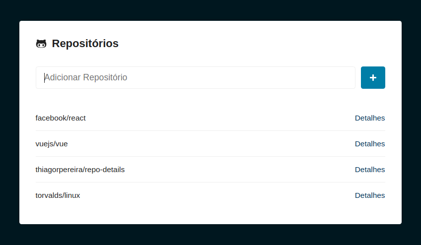
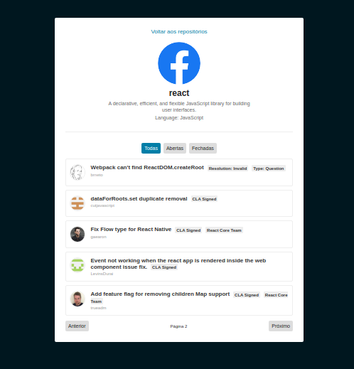

<h1 align="center">
    React GitHub Repositories List
</h1>

<h4 align="center">
  List your favorite GitHub repositories and see information and issues for each of them.
</h4>

<div></div>

<p align="center">
  <a href="https://thiagorpereira-repolist.herokuapp.com/" target="_blank">
    
  </a>
</p>

<div align="center"></div>

### [Live Demo on Netlify](https://thiagorpereira-github.netlify.app/)

## :rocket: Technologies

-  [ReactJS](https://reactjs.org/)
-  [React Router v4](https://github.com/ReactTraining/react-router)
-  [styled-components](https://www.styled-components.com/)
-  [GitHub REST API v3](https://developer.github.com/v3/)
-  [VS Code][vc] with [EditorConfig][vceditconfig] and [ESLint][vceslint]

## :information_source: How To Use

To clone and run this application, you'll need [Git](https://git-scm.com), [Node.js v10.16][nodejs] or higher + [Yarn v1.13][yarn] or higher installed on your computer. From your command line:

```bash
# Clone this repository
$ git clone https://github.com/thiagorpereira/repo-details-react

# Go into the repository
$ cd repo-details-react

# Install dependencies
$ yarn install

# Run the app
$ yarn start
```

## :memo: License
This project is under the MIT license. See the [LICENSE](https://github.com/thiagorpereira/repo-details-react/blob/master/LICENSE) for more information.


[nodejs]: https://nodejs.org/
[yarn]: https://yarnpkg.com/
[vc]: https://code.visualstudio.com/
[vceditconfig]: https://marketplace.visualstudio.com/items?itemName=EditorConfig.EditorConfig
[vceslint]: https://marketplace.visualstudio.com/items?itemName=dbaeumer.vscode-eslint
